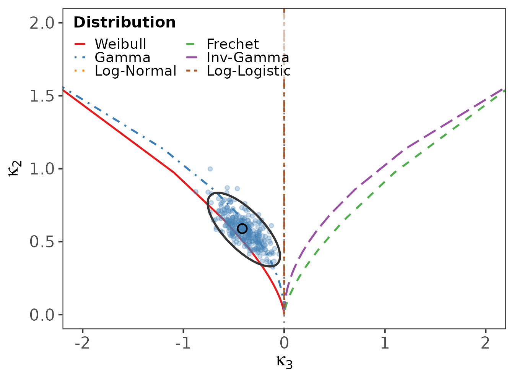
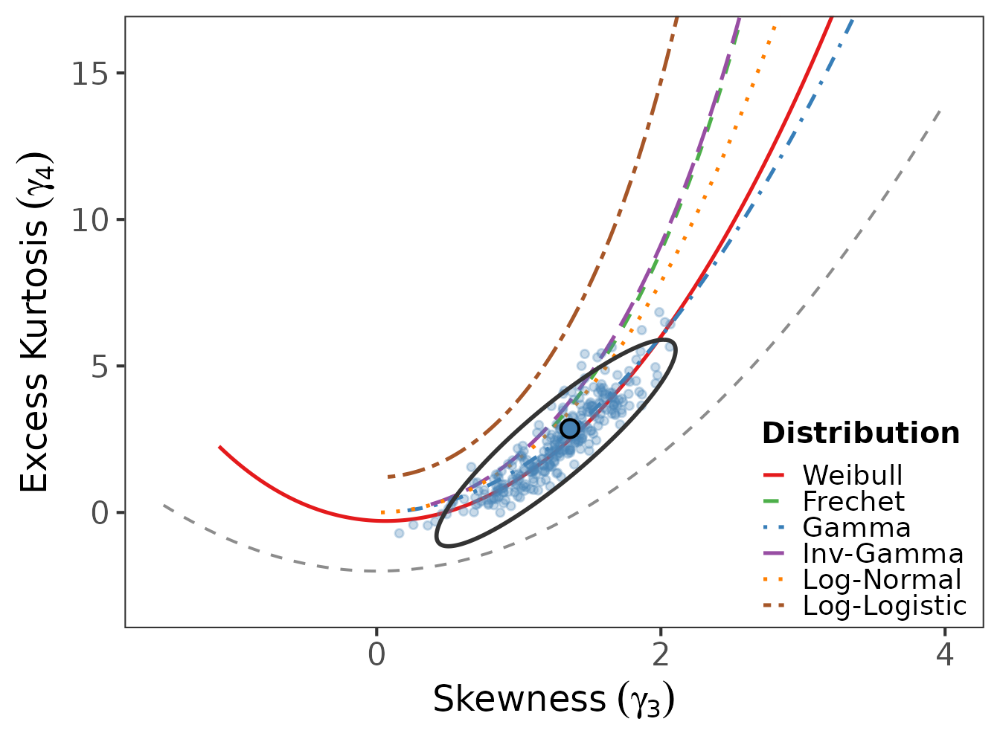
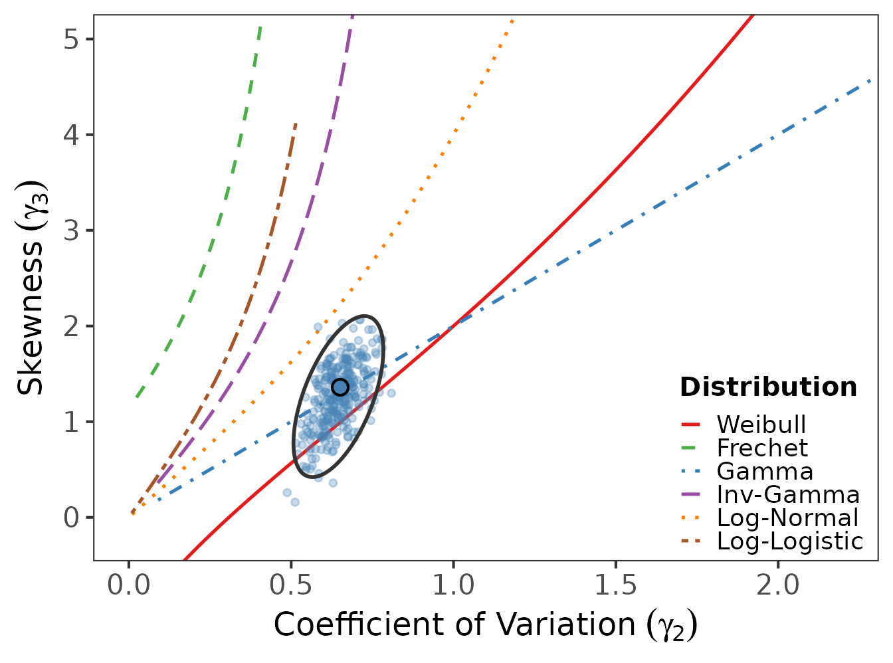
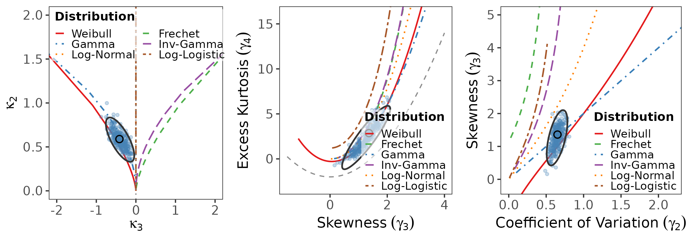
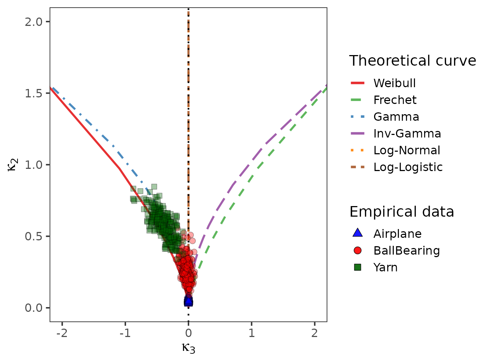

# The three diagnostic diagrams

``` r

library(logcumulant)
data(reliability_datasets)
yarn <- reliability_datasets$Yarn
```

The package provides three complementary moment-ratio diagrams. Each
overlays the theoretical loci of the six reference families with a
bootstrap cloud of the sample estimate and a 95% concentration ellipse.

## Log-cumulant diagram

Plots $`\kappa_3`$ (log-skewness) against $`\kappa_2`$ (log-variance).
The vertical axis $`\kappa_3 = 0`$ is where the
symmetric-on-the-log-scale families (Log-Normal, Log-Logistic) lie.

``` r

log_cumulant_diagram(yarn, "Yarn", B = 300)
```



## Kurtosis-skewness diagram

On the original scale: skewness $`\gamma_3`$ versus excess kurtosis
$`\gamma_4`$, with the feasible-region boundary
$`\gamma_4 = \gamma_3^2 - 2`$.

``` r

kurtosis_diagram(yarn, "Yarn", B = 300)
```



## Coefficient-of-variation diagram

Coefficient of variation $`\gamma_2`$ versus skewness $`\gamma_3`$,
again on the original scale.

``` r

cv_diagram(yarn, "Yarn", B = 300)
```



## All three at once

``` r

three_diagrams(yarn, "Yarn", B = 300)
```



## Several datasets on one diagram

[`multi_lc_diagram()`](https://raydonal.github.io/logcumulant/reference/multi_lc_diagram.md)
overlays bootstrap clouds for several datasets, distinguished by colour
and plotting symbol.

``` r

multi_lc_diagram(
  reliability_datasets[c("Airplane", "BallBearing", "Yarn")],
  B = 300
)
```


