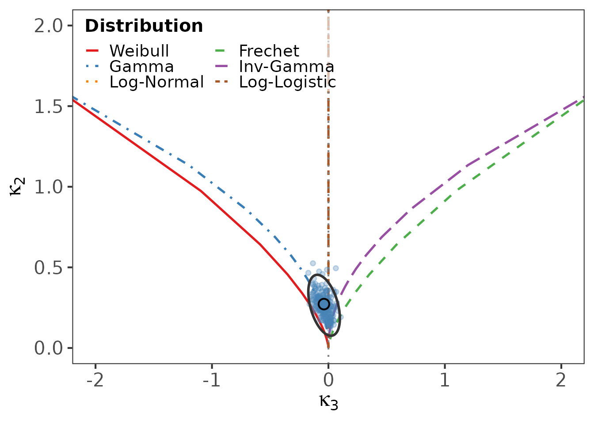

# Getting started with logcumulant

``` r

library(logcumulant)
data(reliability_datasets)
```

## Why log-cumulants?

For positive-support data the Mellin transform plays the role that the
Fourier or Laplace transform plays on the whole line. Differentiating
the Mellin characteristic function at its central point yields the
**log-cumulants** $`\kappa_1, \kappa_2, \ldots`$: the cumulants of
$`\log X`$. These quantities are natural shape descriptors for
reliability distributions and behave well under the multiplicative
structure typical of lifetime data.

The package turns these descriptors into (i) diagnostic **diagrams** and
(ii) formal **goodness-of-fit tests**.

## A first analysis

We use the classic ball-bearing fatigue-life dataset bundled with the
package.

``` r

bb <- reliability_datasets$BallBearing
length(bb)
#> [1] 23
summary(bb)
#>    Min. 1st Qu.  Median    Mean 3rd Qu.    Max. 
#>   17.88   47.04   67.80   72.22   95.88  173.40
```

The quickest entry point is
[`plot_lc()`](https://raydonal.github.io/logcumulant/reference/plot_lc.md),
which draws the log-cumulant diagram with a bootstrap cloud of the
sample estimate:

``` r

plot_lc(bb, B = 200)
```



The sample point sits near the Weibull and Gamma loci, suggesting a
light-tailed model.

## Comparing candidate models

[`gof_compare_all()`](https://raydonal.github.io/logcumulant/reference/gof_compare_all.md)
fits all six families and reports the three $`T^2`$ statistics, the
Anderson–Darling and Cramer–von Mises tests, and the AIC. The parametric
bootstrap is recommended for the p-values:

``` r

gof_compare_all(bb, use_bootstrap = TRUE, B = 199, seed = 1)
#>              Dist     T2_23      p_23      T2_123        p_123    T2_full
#> stat      Weibull 1.7684442 0.1835747   4.1163555 1.276864e-01 12.4859496
#> stat1     Frechet 1.3820542 0.2397516 269.3727725 3.209561e-59 79.9397649
#> stat2       Gamma 0.4802072 0.4883285   0.4003921 8.185703e-01  0.8889327
#> stat3    InvGamma 0.9577940 0.3277433   4.6352936 9.850512e-02  5.5465619
#> stat4   LogNormal 0.2566868 0.6124055   0.3937496 8.212935e-01  2.6732346
#> stat5 LogLogistic 0.2275893 0.6333171   0.2440233 8.851381e-01  3.6104646
#>             p_full        AD      AD_p        CvM     CvM_p      AIC     pb_23
#> stat  1.408080e-02 0.3285906 0.9152403 0.05795851 0.8268379 231.3826 0.3316583
#> stat1 1.793764e-16 0.5755471 0.6714156 0.07790501 0.7040599 235.5642 0.4572864
#> stat2 9.261432e-01 0.2153670 0.9856293 0.03909866 0.9377403 230.0586 0.5728643
#> stat3 2.356669e-01 0.3140940 0.9272090 0.04229426 0.9209759 232.3086 0.3567839
#> stat4 6.139063e-01 0.1888150 0.9931619 0.02896580 0.9794400 230.2571 0.6130653
#> stat5 4.612819e-01 0.1957724 0.9915227 0.03269626 0.9664924 230.7445 0.8040201
#>          pb_123   pb_full
#> stat  0.1758794 0.4321608
#> stat1 0.0000000 0.1256281
#> stat2 0.5276382 0.9849246
#> stat3 0.1005025 0.5527638
#> stat4 0.4522613 0.8040201
#> stat5 0.7236181 0.7487437
```

## Where to go next

- [`vignette("diagrams")`](https://raydonal.github.io/logcumulant/articles/diagrams.md)
  explains the three diagnostic diagrams.
- [`vignette("gof-tests")`](https://raydonal.github.io/logcumulant/articles/gof-tests.md)
  covers the tests and why the bootstrap is needed.
- [`vignette("simulation")`](https://raydonal.github.io/logcumulant/articles/simulation.md)
  reproduces the size and power studies.
